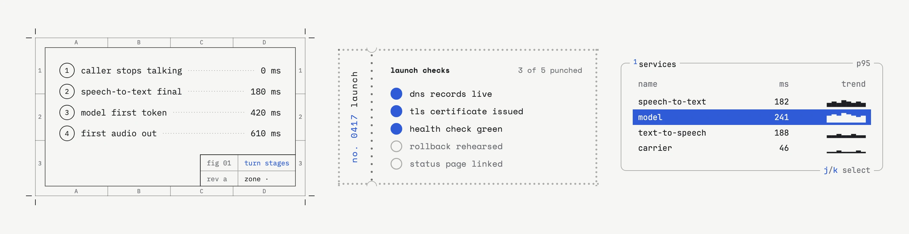
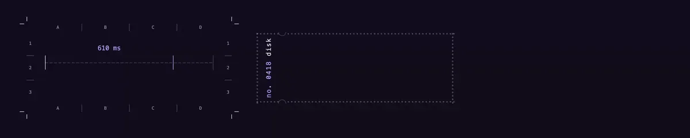
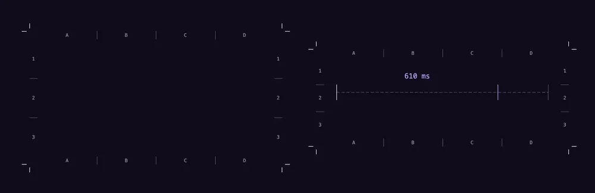
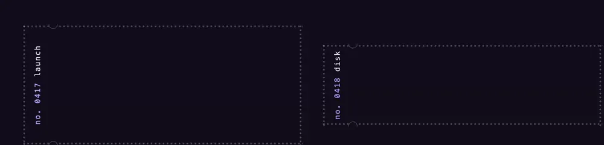

<p align="center">
  <a href="https://crwl.tech">
    <picture>
      <source media="(prefers-color-scheme: dark)" srcset="docs/media/banner-dark.webp">
      
    </picture>
  </a>
</p>

<h1 align="center">tick</h1>

<p align="center">
  Framed figures for docs, dashboards and write-ups.<br>
  Three styles, ten themes, plain CSS and one small optional script.<br>
  <a href="https://crwl.tech"><b>crwl.tech</b></a>
</p>

<p align="center">
  
</p>

Every figure renders with the stylesheet alone. The script adds dragging, punching, zone readouts, row selection and live graphs. Each figure has an animated entrance and a static mode.

## plot

An engineering drawing sheet: a zoned border, crop marks, a title block, and values drawn as dimension lines. Hover for the grid zone, drag a dimension to resize it.



## stub

A perforated ticket. The tear line splits off a numbered stub. Click a hole to punch it, drag across a row to punch it, click the stub to tear it off.



## tui

A terminal monitor panel: a hotkey number in the title, key hints on the bottom edge, and a live braille trace. Focus a panel, then use j and k, or space to pause.


## Use

```html
<link rel="stylesheet" href="https://crwl.tech/tick.css">
<script type="module" src="https://crwl.tech/tick.js"></script>
```

Copy a figure from the site or from `llms.txt`, then:

- pick a theme with `data-tk-theme="ultraviolet"` on any ancestor,
- turn motion off with `data-tk-static` on any ancestor.

Themes: paper, graphite, phosphor, blueprint, riso, moss, signal, ultraviolet, rosewater, glacier. With no theme set, figures follow the system: paper in light mode, ultraviolet in dark mode.

The library is about 7 KB gzipped. Each font face loads only when a figure on the page uses it.

## For agents

[`llms.txt`](https://crwl.tech/llms.txt) holds the markup for every figure. [`skill.md`](https://crwl.tech/skill.md) is a skill file that says which figure fits which data.

## Develop

```sh
bun test
bun run llms
bunx wrangler dev
```

`scripts/fonts.sh` rebuilds the subsetted fonts in `public/fonts` from the source TTF files. Pushes to `main` deploy to Cloudflare, and every other branch gets a preview build.

## Credits

Fonts: IBM Plex Mono, Space Mono, JetBrains Mono and Noto Sans Symbols 2, all under the SIL Open Font License. They ship subsetted and renamed, with their licenses in `public/fonts`. The idea of framed figures for agent-written docs came from [mdxcn](https://mdxcn.dev).

## License

MIT
